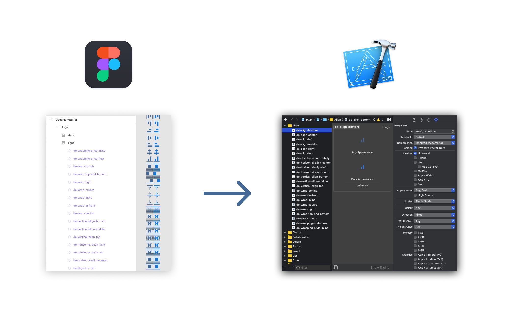

# Xcode Assets Export

A Figma plugin for export Xcode assets.

## Installation

#### Get the Figma desktop app.
At this time, plugin development and testing needs to be done using the Figma desktop app. This is because Figma needs to read your code saved as a local file. The Figma desktop app can be downloaded here: https://www.figma.com/downloads/.

If you already have the desktop app, please make sure to update to the latest version, as several features have been added specifically in order to provide a better plugin development experience.

#### Log in to your account and open the editor
You can open any existing document or create a new one.

#### Go to Menu > Plugins > Development > New Plugin...
This will bring up the "Create a plugin" modal to load existing plugin.

#### Choose a manifest.json from code folder
In the system dialog that appears, select the manifest.json file.

## Features

**Export Assets as PNG** 

Export resources in PDF format based on the structure of the parent frame to the Xcode assets directory structure.

## License

MIT